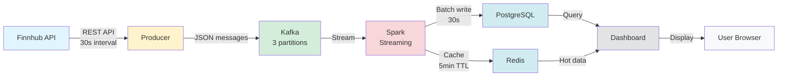
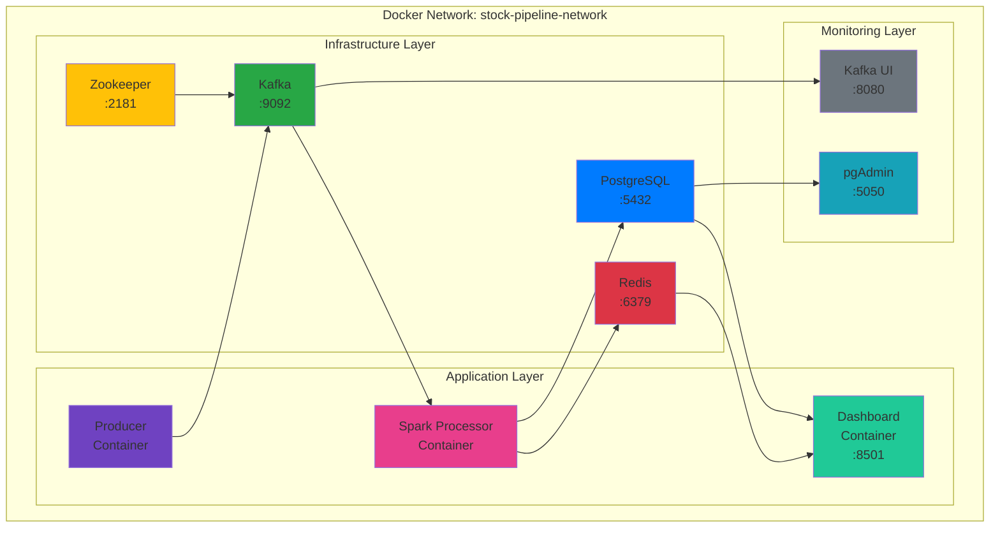
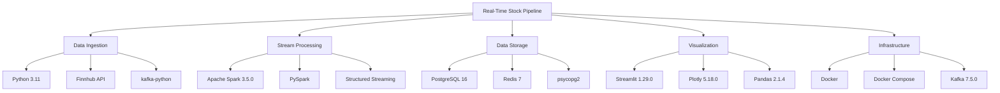
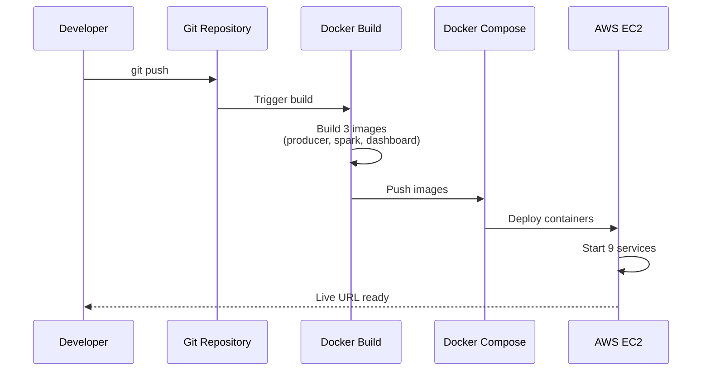

# System Architecture

## Data Flow Diagram


## Container Architecture


## Technology Stack


## Database Schema
```sql
-- Stock Prices (Time-Series Data)
CREATE TABLE stock_prices (
    id SERIAL PRIMARY KEY,
    symbol VARCHAR(10) NOT NULL,
    price DECIMAL(10, 2) NOT NULL,
    volume BIGINT,
    day_high DECIMAL(10, 2),
    day_low DECIMAL(10, 2),
    open_price DECIMAL(10, 2),
    event_time TIMESTAMP NOT NULL,
    ingestion_time TIMESTAMP DEFAULT CURRENT_TIMESTAMP,
    UNIQUE(symbol, event_time)
);

-- Indexes for fast queries
CREATE INDEX idx_symbol_time ON stock_prices(symbol, event_time DESC);
CREATE INDEX idx_event_time ON stock_prices(event_time DESC);
```

## Deployment Flow

